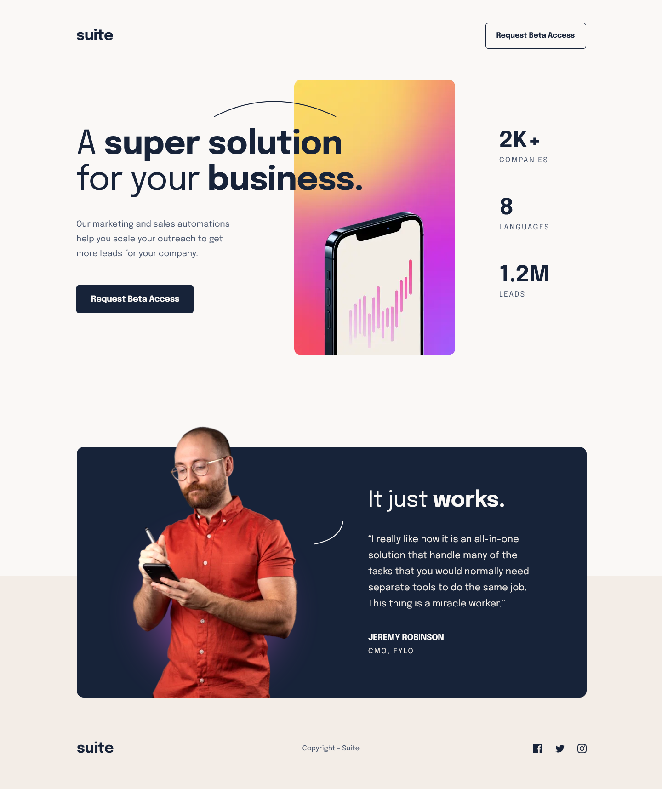

# Frontend Mentor - Suite landing page solution

This is a solution to the [Suite landing page challenge on Frontend Mentor](https://www.frontendmentor.io/challenges/suite-landing-page-tj_eaU-Ra).

## Table of contents

- [Frontend Mentor - Suite landing page solution](#frontend-mentor---suite-landing-page-solution)
  - [Table of contents](#table-of-contents)
  - [Overview](#overview)
    - [The challenge](#the-challenge)
  - [My process](#my-process)
    - [Built with](#built-with)
  - [Author](#author)

## Overview

### The challenge

Users should be able to:

- View the optimal layout depending on their device's screen size
- See hover states for interactive elements

### Screenshot

### Links

- Solution URL: [Mobile-first solution using Flexbox, Grid and CSS Custom](https://www.frontendmentor.io/solutions/mobilefirst-solution-using-flexbox-grid-and-css-custom-properties-LMpqxN_gqc)
- Live Site URL: [Frontend Mentor - Suite landing page](https://azganoth.github.io/suite-landing-page/)

## My process

### Built with

- HTML5
  - Semantic markup
- CSS3
  - Custom properties
  - Flexbox
  - Grid
- Mobile-first workflow

## Author

- Website - [Ademir José Ferreira Júnior](https://github.com/Azganoth)
- Frontend Mentor - [@Azganoth](https://www.frontendmentor.io/profile/Azganoth)
